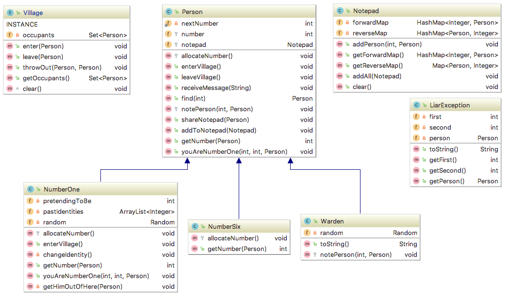

# Instructions

This tutorial gives you:

* A simple code base, to explore and model using class diagrams
* A puzzle to solve, in why Number Six's plan fails
* A secondary puzzle, that corresponds to a common bug in Java programs
* A redesign task

Hopefully, this will give you a little experience modelling and redesigning an unfamiliar code base &mdash; a skill you'll need for your project work.

## The code in a diagram

We'll introduce class diagrams and UML a litte later in the course.
But for the moment, it might be useful for you to take a look at the code
in a diagram form to help you explore it. This diagram was generated with
IntelliJ IDEA's automatic diagram creation:



The Village is a mysterious prison that feels like a quaint seaside resort,
but nobody knows who are the guards and who are the prisoners. And nobody,
not even the guards, can leave. It is run by the secretive Number One, and
nobody knows who that is.

The Village contains a set of People. Some of these are ordinary people, 
but there are also Wardens, Number Six (the protagonist), and Number One
(the nefarious secretive villain)

And for this story, Number Six has asked each villager to have a Notepad to
try to help them remember what everyone's number is -- or at least, what
they say it is. And by comparing notepads, we're going to look for who's 
lying.

Have a look around the code, and see how it relates to the diagram

## Try the code

Read and run the tests. 

The tests contain the story for today, so open up TestVillage in the 
`com.wbillingsley.tutorials.classdiags.village` package in your IDE.

The comments in the tests will (hopefully) introduce features of JUnit, and
lead you around the code. You can run the tests with 

```sh
gradle test
```

from the command-line, in which case it will place an HTML report in the 
`build/reports` directory.

Or you can run the tests from your IDE -- usually, right-clicking on 
TestVillage and selecting the "Run" option will work. At least, it does
in IntelliJ.


## Design patterns exercise

This is for if you've been introduced to UML diagrams and design patterns (a little later in the course)

The Village builds a telephone exchange. You have been asked to restructure the program using a Mediator pattern so that villagers can text important messages to each other through the exchange, rather than have to find each other at all. Draw a class diagram of your revised design, but don’t write the code yet.

(Omit the fields, methods, etc for classes that haven’t changed)


### Restructuring Exercise

Modify the code to implement the Mediator pattern design from the
previous exercise.


